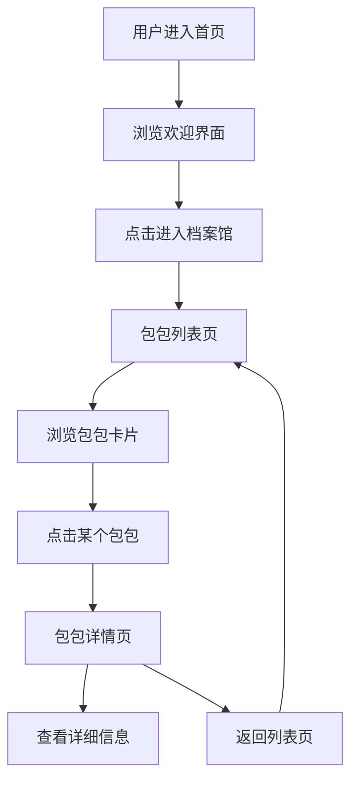

## 1. 产品概述

"包包世界档案馆"是一个童话风格的Web应用，用户可以浏览各种拟人化的包包角色。每个包包都被设定为一个拥有独特性格和故事的居民，用户可以在档案馆中探索这些可爱的包包角色。

- **核心价值**：将日常物品拟人化，创造一个充满想象力的童话世界
- **目标用户**：喜欢可爱风格、收集癖、童话故事的用户
- **产品定位**：轻量级的内容浏览类Web应用

## 2. 核心功能

### 2.1 功能模块

1. **首页**：童话风格的欢迎界面，档案馆简介，精选包包推荐，入口导航
2. **包包列表页**：展示所有包包居民卡片，支持浏览和筛选
3. **包包详情页**：展示包包的详细信息，包括名称、风格、容量、性格设定、收藏价值

### 2.2 页面详情

| 页面名称 | 模块名称 | 功能描述 |
|-----------|-------------|---------------------|
| 首页 | Hero区域 | 童话风格标题，档案馆介绍，装饰性元素 |
| 首页 | 精选推荐 | 展示3-4个特色包包角色卡片 |
| 首页 | 导航入口 | 引导用户进入包包列表页 |
| 包包列表页 | 顶部导航 | 返回首页，标题展示 |
| 包包列表页 | 包包卡片网格 | 以卡片形式展示所有包包居民 |
| 包包详情页 | 包包形象展示 | 大幅展示包包形象 |
| 包包详情页 | 属性信息 | 风格、容量、收藏价值等信息卡片 |
| 包包详情页 | 性格设定 | 详细的角色性格和故事描述 |
| 包包详情页 | 返回导航 | 返回列表页的入口 |

## 3. 核心流程

用户从首页进入，通过导航进入包包列表，点击感兴趣的包包查看详情，可以随时返回继续浏览。

## 4. 用户界面设计

### 4.1 设计风格

- **整体风格**：童话绘本风格，柔和梦幻，带有手绘质感
- **主色调**：奶油粉 (#FFE4E6)、淡紫 (#E9D5FF)、鹅黄 (#FEF3C7)
- **辅助色**：苔藓绿 (#BBF7D0)、天空蓝 (#BAE6FD)
- **强调色**：玫瑰粉 (#FB7185)、深紫 (#A855F7)
- **字体**：标题使用圆润可爱的衬线/手写风格字体，正文使用清晰易读的无衬线字体
- **按钮风格**：圆润饱满，带有轻微阴影和渐变，悬停时有弹跳效果
- **卡片风格**：圆角大卡片，带柔和阴影和渐变背景，有手绘边框感
- **装饰元素**：星星、云朵、花朵、蝴蝶结等童话元素点缀

### 4.2 页面设计概述

| 页面名称 | 模块名称 | UI元素 |
|-----------|-------------|-------------|
| 首页 | Hero区域 | 大标题、副标题、装饰云朵、星星闪烁动画、渐入效果 |
| 首页 | 精选推荐 | 横向滚动卡片、悬停放大效果、柔和阴影 |
| 首页 | 入口按钮 | 大圆角按钮、渐变背景、弹跳悬停动画 |
| 包包列表页 | 卡片网格 | 响应式网格布局、卡片悬停上浮、图片淡入 |
| 包包详情页 | 信息展示 | 大图片、属性标签卡片、分段内容区、装饰分隔线 |
| 全局 | 导航栏 | 透明/半透明背景、图标按钮、平滑过渡 |

### 4.3 响应式设计

- **设计策略**：桌面端优先，适配平板和移动端
- **断点**：
  - 桌面端：1024px+，3-4列卡片网格
  - 平板端：768px-1023px，2列卡片网格
  - 移动端：<768px，1列卡片网格，内容自适应
- **触控优化**：移动端按钮和卡片增大点击区域，优化触摸体验

### 4.4 动效设计

- **页面加载**：元素渐入+轻微上浮的stagger动画
- **卡片悬停**：轻微上浮、阴影加深、缩放效果
- **按钮交互**：悬停放大、点击回弹
- **滚动效果**：导航栏背景渐变、元素滚动显现
- **装饰元素**：星星闪烁、云朵漂浮等循环动画
