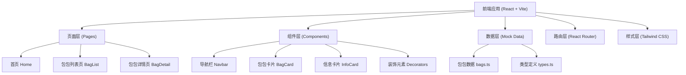

## 1. 架构设计



纯前端架构，使用Mock数据，不涉及后端服务。

## 2. 技术描述

- **前端框架**：React@18 + TypeScript
- **构建工具**：Vite
- **样式方案**：Tailwind CSS 3
- **路由管理**：react-router-dom
- **状态管理**：zustand（轻量级，可选）
- **图标库**：lucide-react
- **数据方案**：前端Mock数据，无需后端

## 3. 路由定义

| 路由 | 页面 | 用途 |
|-------|---------|---------|
| `/` | Home | 首页 - 欢迎界面、精选推荐 |
| `/bags` | BagList | 包包列表页 - 所有包包居民展示 |
| `/bags/:id` | BagDetail | 包包详情页 - 单个包包详细信息 |

## 4. 数据模型

### 4.1 类型定义

```typescript
interface Bag {
  id: string;
  name: string;
  style: string;
  capacity: string;
  personality: string;
  collectValue: string;
  description: string;
  imageUrl: string;
  color: string;
  featured?: boolean;
}
```

### 4.2 数据字段说明

| 字段 | 类型 | 说明 |
|------|------|------|
| id | string | 唯一标识 |
| name | string | 包包名称 |
| style | string | 风格类型（如：复古、可爱、优雅等） |
| capacity | string | 容量描述 |
| personality | string | 性格设定 |
| collectValue | string | 收藏价值评级 |
| description | string | 详细描述/故事 |
| imageUrl | string | 包包形象图片URL |
| color | string | 主题色（用于卡片装饰） |
| featured | boolean | 是否为精选推荐 |

## 5. 项目结构

```
src/
├── components/          # 可复用组件
│   ├── Navbar.tsx       # 导航栏
│   ├── BagCard.tsx      # 包包卡片
│   ├── InfoCard.tsx     # 信息卡片
│   └── Decorators.tsx   # 装饰元素（星星、云朵等）
├── pages/               # 页面组件
│   ├── Home.tsx         # 首页
│   ├── BagList.tsx      # 包包列表页
│   └── BagDetail.tsx    # 包包详情页
├── data/                # Mock数据
│   └── bags.ts          # 包包数据
├── types/               # TypeScript类型
│   └── index.ts         # 类型定义
├── App.tsx              # 根组件（路由配置）
├── main.tsx             # 入口文件
└── index.css            # 全局样式
```

## 6. 开发规范

- **组件命名**：PascalCase，与文件同名
- **组件大小**：单组件不超过300行，复杂组件拆分子组件
- **样式方案**：优先使用Tailwind CSS utility类，特殊情况使用CSS-in-JS或全局CSS
- **路由规范**：使用react-router-dom v6，不使用动态import/lazy加载路由级组件
- **类型安全**：所有数据和组件props都有TypeScript类型定义
- **图片资源**：使用在线图片服务生成包包形象图
